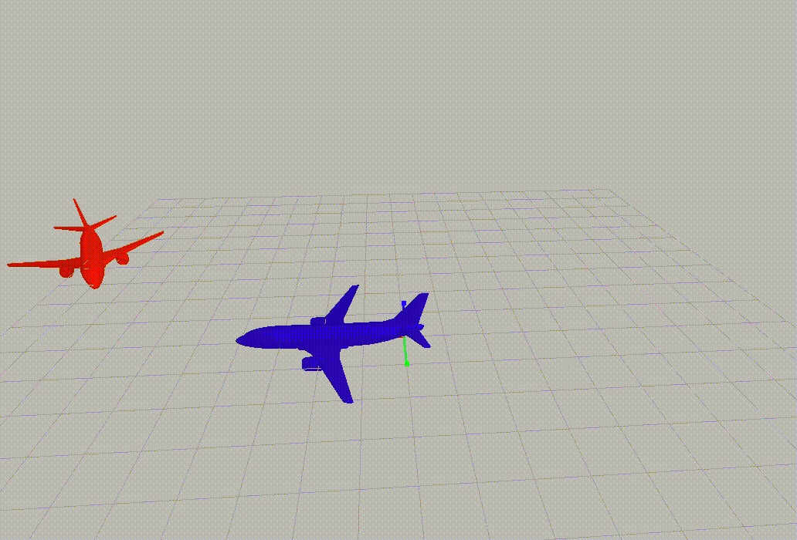

# gym_pairwiseAircraft
Gym and pybullet based pairwise-aircraft conflict environment 

1. Installation

   git clone this repository and cd into this directory, then:

   ```
   pip install -e .
   ```

   

2. Some features

   Conflicts:



Conflict resolution:

